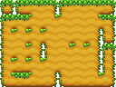

# Quarter Tile Unpacker

Minimal tool written in Processing 4 to convert 5 tiles to 47. It uses the corners of each tile to assemble more tiles. It has only been tested with 16x16 tiles but should work for other sizes. Refer to the image below for how the tiles should be layed out. Credit to [https://opengameart.org/content/seamless-tileset-template-ii](https://opengameart.org/content/seamless-tileset-template-ii) for the output template.

Original:

Unpacked:

